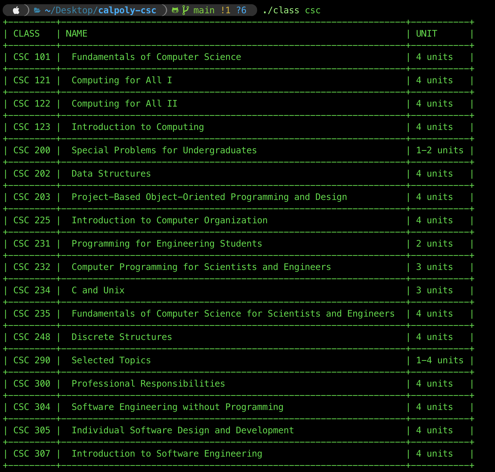

# Calpoly-classes

Get the classes, name, and number of units in you terminal. This code is written in go language.

```go
go get .
go build -o class -ldflags="-s -w" main.go
```

## Usage:
Please choose between csc, cpe, data, stat, math to go printed table of your classes.

```bash
usage: ./class [csc | cpe | data | stat | math]
```



## Compiled Version:

I added the compiled version of my code for windows x64 and mac so that if you don't have go, you use the compiled one.

**Windows:**

```bash
classw.exe csc
```
**Mac:**

```bash
./class csc
```
